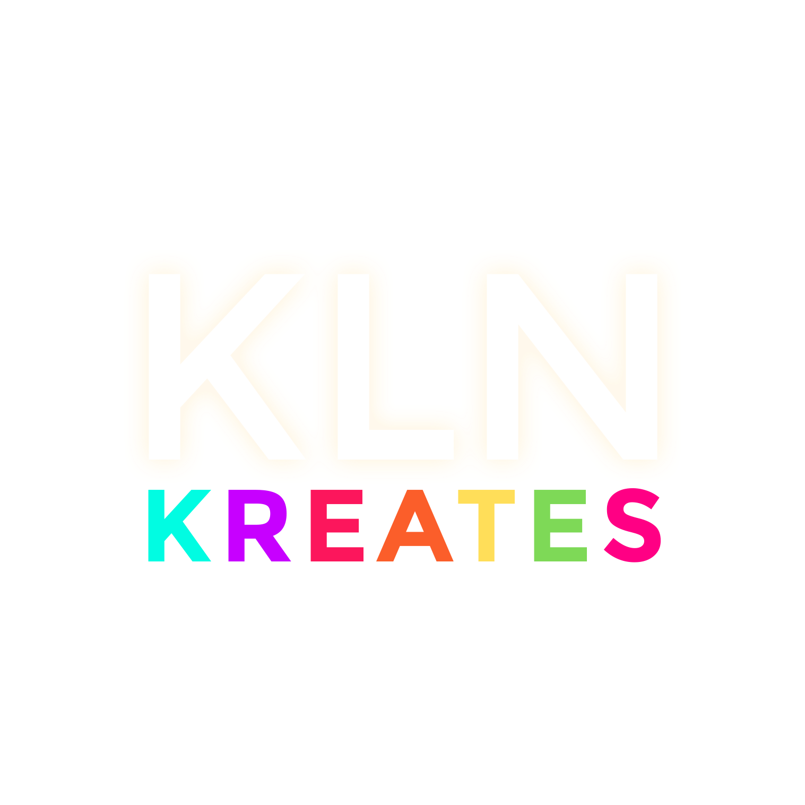

<a name="readme-top">

 

 

  <a href="https://github.com/Pudgeeba">
  <!-- TODO: If you want to add logo or banner you can add it here -->
    
  </a>
<!-- TODO: Change Title to the name of the title of your Project -->
  <h3 align="center">Seatwork #03: Headers & Footers</h3>

<!-- TODO: Make a short description -->

  This project is for exploring various versions of Headers and Footers as we showcase HTML and CSS skills, featuring Multiple Pages, Effects, and Container Manipulations.

 

<!-- TODO: Change the zyx-0314 into your github username  -->
<!-- TODO: Change the WD-Template-Project into the same name of your folder -->

---

 
 

<!-- TODO: If you want to add more layers for your readme -->

  
Table of Contents

  <ol>
    <li>
      <a href="#overview">Overview</a>
      <ol>
        <li>
          <a href="#key-components">Key Components</a>
        </li>
        <li>
          <a href="#technology">Technology</a>
        </li>
      </ol>
    </li>
    <li>
      <a href="#rule,-practices-and-principles">Rules, Practices and Principles</a>
    </li>
    <li>
      <a href="#resources">Resources</a>
    </li>
  </ol>

---

## Overview

<!-- TODO: To be changed -->
<!-- The following are just sample -->
This project focuses on Website Headers and footers. It is for exploring various versions of Headers and Footers with the use of HTML and CSS, showcasing different skills related to the 2 different languages, featuring Multiple Pages, Effects, and Container Manipulations. The project consistsof the following key components: a Landing page, 5 Static Header Designs section, 5 Animated Header with Animation section, 5 Static Footer Designs Section, and 5 Animated Footers with Animation-to briefly demonstrate what possible designs you can implement on your own website or even for commissions!

### Key Components
<!-- TODO: List of Key Components -->
<!-- The following are just sample -->
- Landing page
- Static Header Design
- Animated Header Animation
- Static Footer Design
- Animated Footer Animation

### Technology
<!-- TODO: List of Technology Used -->

## Rules, Practices and Principles
1. Always use WD- in the front of the Title of the Project for the Subject followed by your custom naming.
2. Do not rename any .html files; always use index.html as the filename.
3. Place Files in their respective folders.
4. All file naming are in camel case.
   - Camel case is naming format where there is no white space in separation of each words, the first word is in all lower case while the succeding words first letter are in upper followed by lower cased letters.
   - ex.: buttonAnimatedStyle.css
5. Use only External CSS.
6. Renaming of Pages folder names are a must, and relates to what it is doing or data it holding.
7. File Structure to follow below.

WD-Seatwork-3
└─ assets
|   └─ css
|   |   └─ style.css
|   └─ img
|   |   └─ cinnamoroll.png
|   |   └─ kln-kreates-logo.png
|   |   └─ Sanrio-logo.png
|   |   
|   └─ js
|       └─ script.js
└─ pages
|  └─ footer-gallery
|     └─ assets
|     |  └─ css
|     |  |  └─ style.css
|     |  |  └─ badtz-maru-head-logo.png
|     |  |  └─ hello-kitty-bow-logo.png
|     |  |  └─ hello-kitty-logo.png
|     |  |  └─ keroppi-head-logo.png
|     |  |  └─ kuromi-logo.png
|     |  |  └─ tuxedo-sam-logo.png
|     |  └─ js
|     |     └─ script.js
|     └─ index.html
|  └─ header-gallery
|     └─ assets
|     |  └─ css
|     |  |  └─ style.css
|     |  └─ img
|     |  |  └─ badtz-maru-head-logo.png
|     |  |  └─ hello-kitty-bow-logo.png
|     |  |  └─ hello-kitty-logo.png
|     |  |  └─ keroppi-head-logo.png
|     |  |  └─ kuromi-logo.png
|     |  |  └─ tuxedo-sam-logo.png
|     |  └─ js
|     |     └─ script.js
|     └─ index.html
└─ index.html
└─ readme.md

## Resources

<!-- TODO: Add References -->
| Title | Purpose | Link |
|-|-|-|
| W3School | HTML/CSS | https://www.w3schools.com/ |
